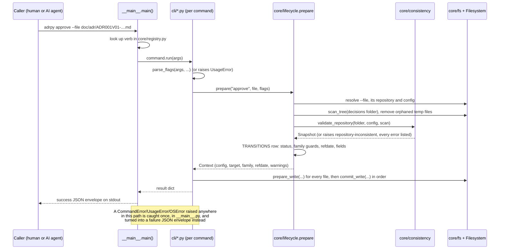
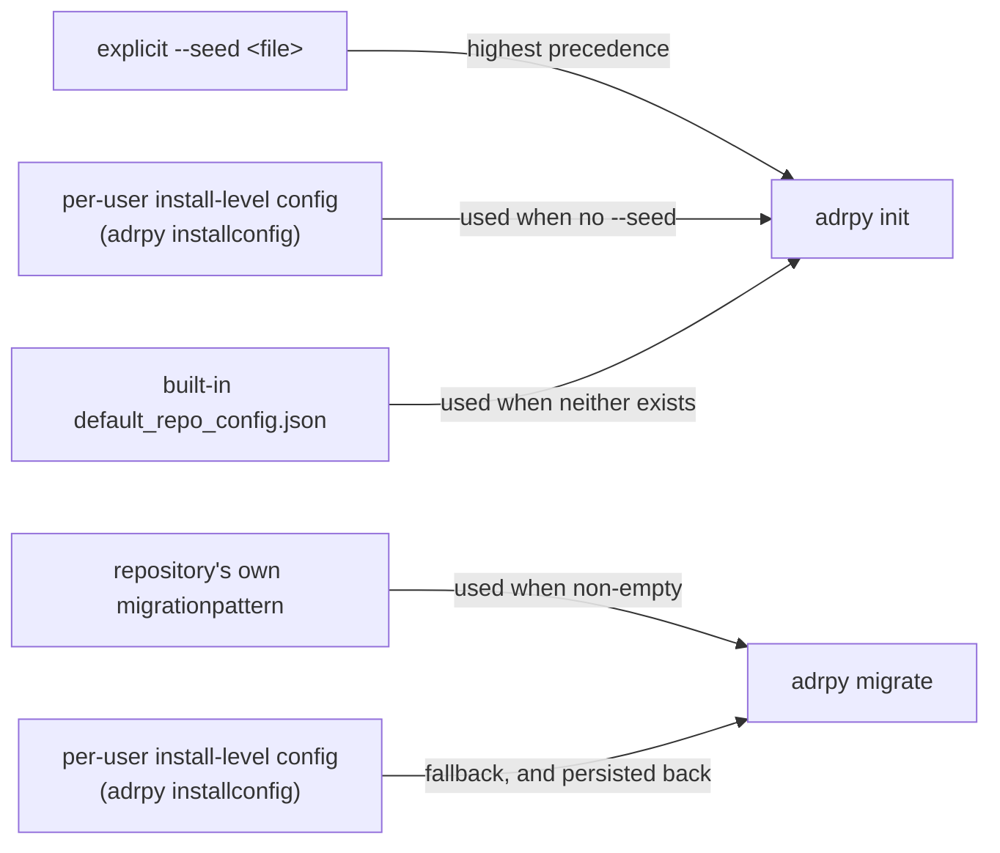
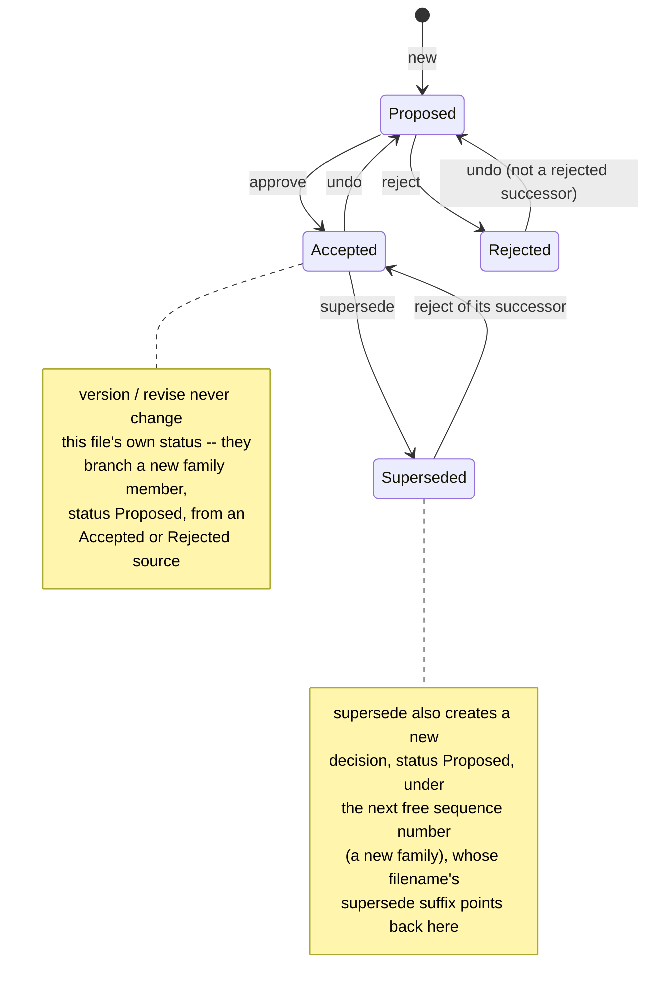
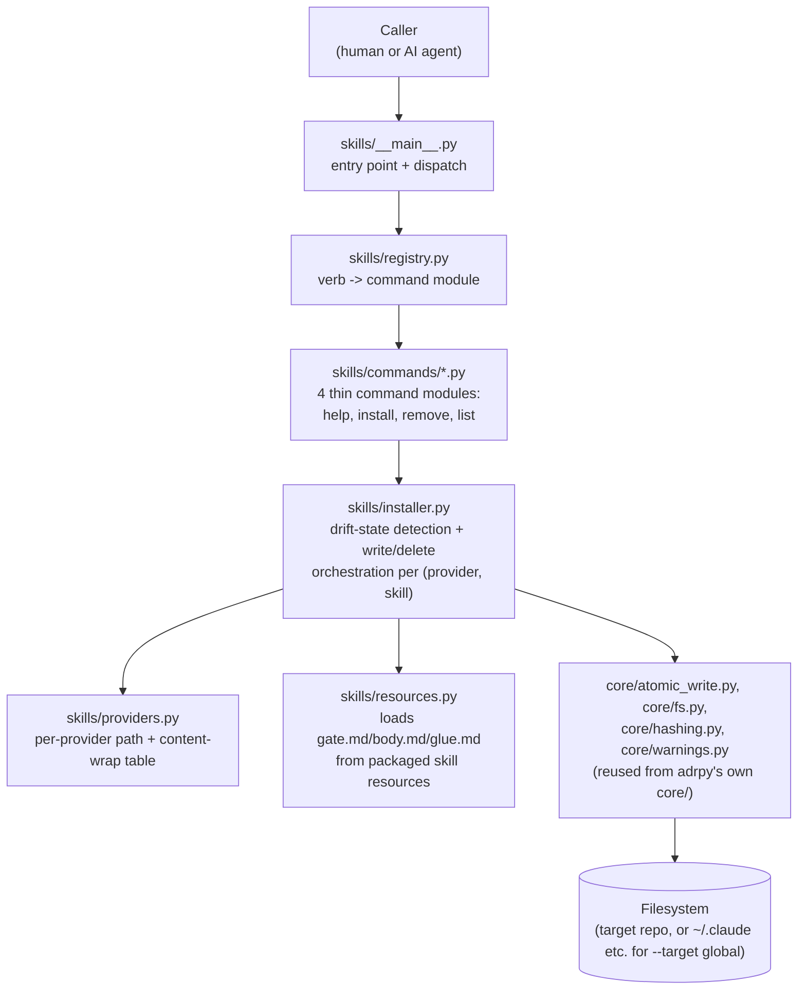
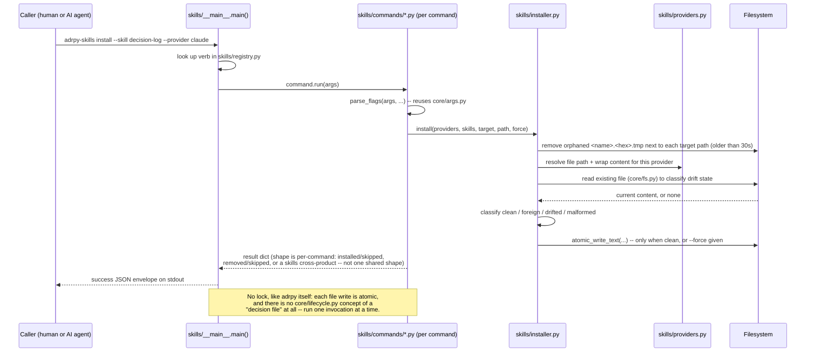

[← README](../README.md)

# Architecture

This page explains how `adrpy-ai` is put together and why: the module
layout, the request lifecycle, the two load-bearing architectural
choices (the single-owner model, with the repository validated before
every action, and the install-level config), the decision lifecycle the whole tool exists to manage, and -- as a separate
concern -- the `adrpy-skills` subsystem that ships alongside it in the
same distribution. For the individual command contracts, see
[`doc/commands/`](commands/INDEX.md); for the project's own recorded
architectural decisions and their full rationale, see [`doc/adr/`](adr/)
and [`doc/decision-log/`](decision-log/INDEX.md) -- this page summarizes
and links to them, it does not replace them.

## Why this project exists

`adrpy-ai` manages [Architecture Decision Records](https://adr.github.io/)
from the command line, built around three constraints stated directly in
its own package metadata and carried consistently through every command:

- **JSON in, JSON out, no wizard.** Every command is fully driven by
  flags and returns a single JSON object on stdout -- nothing waits for a
  keypress. This is not a UX preference; it is what makes the tool safe
  to script and safe for an AI agent to call without a human in the loop.
- **Self-documenting.** `adrpy help <command>` returns the exact same
  structured contract (arguments, types, failure codes) a human reads in
  `doc/commands/` -- the documentation and the code cannot silently drift
  apart, because the per-command pages in this repository are generated
  directly from that same `describe()` output, not written independently
  of it.
- **Zero runtime dependencies.** Every capability -- argument parsing,
  atomic writes, retry logic, per-OS path resolution -- is implemented in
  `core/` rather than pulled in from a package, so the tool has no
  supply-chain surface beyond the Python standard library.

`adrpy-ai` is the reference for the rules it shares with AdrPlus
(C#/.NET), by the same author, and reads AdrPlus 1.0.0 repositories -- see
[Relationship to AdrPlus](../README.md#relationship-to-adrplus) in the
main README for what that relationship does and does not mean. This page
only describes `adrpy-ai`'s own architecture.

## Module map

Every command handler in `cli/` is thin: it parses its own flags, then
delegates the actual work -- reading, validating, writing -- to
the shared modules in `core/`. The only `core/` module that imports from
`cli/` is `core/registry.py`, the command table; otherwise the dependency
direction is one-way, always downward through these four
layers:


No single command uses every `core/` module -- Dispatch & contract's four
modules are the one exception, used by every command -- the table below is
the accurate picture; the diagram above is deliberately just the
layering, not a full edge list, because a command-by-module graph for 15
commands x 18 modules is a hairball no one can actually read.

| Concern | Modules | Responsibility |
|---|---|---|
| Dispatch & contract | `registry.py`, `args.py`, `output.py`, `errors.py` | Maps each verb to its command module; parses `--flag value` pairs; builds the JSON envelope and exit code; defines `CommandError`/`UsageError`. Used by every command. |
| Storage | `fs.py`, `atomic_write.py` | Every file read, write and delete goes through `fs.py` (a source-scan test enforces it for the `read_*`/`write_*`/`unlink`/`os.replace`/`remove`/`rename`/`link` calls; a few plain `open()` reads remain outside it): bounded reads with a short retry on a transient `PermissionError`, the two-step write (`prepare_write` puts the complete content in a temp file next to the target, `commit_write` moves it into place, or creates it exclusively, never over an existing file), the one walk of a folder (`scan_tree`) and the cleanup of orphaned temp files. `atomic_write.py` wraps the write for text, bytes and streamed chunks, with the host line endings. |
| Configuration | `config.py`, `install_config.py` | A repository's own `adr-config.adrplus` schema; the per-user install-level config ([ADR002](adr/ADR002V01-install-level-config-is-a-per-user-file-that-seeds-init-and-migrate-instead-of-an-install-directory-template.md)). |
| Repository model & validation | `consistency.py`, `family.py` | One scan of the decisions folder into a snapshot of `Decision`s, each with a status derived once from the closed set of combinations, and the validator that checks every invariant ([lifecycle.md](lifecycle.md#validate-the-whole-repository-before-acting)); the family rules both it and the commands share (which filename names a successor, which member is live). |
| Decision file mechanics | `lifecycle.py`, `header.py`, `naming.py`, `casing.py`, `security.py`, `text.py` | The shared preamble of the file commands (`prepare`) and the transition table it follows; the 12-line header format, its free-text rules included; filename parsing/building for both naming schemes; title case transforms; path-escape guards; small text rules (plain ASCII numbers, leading BOMs). |
| Decision log | `decision_log.py` | The mechanical half of a decision-log entry ([ADR003V01](adr/ADR003V01-decision-log-entries-separate-human-reviewed-judgment-from-tool-executed-mechanics-via-a-future-adrpy-log-command.md)): filename/structured-line construction, `Round` allocation, and `INDEX.md` regeneration -- judgment (classification, wording) stays outside the tool, in the [decision-log workflow](decision-log-workflow.md). Its own directory (`folderlog`) is independently configurable and recursively scanned, decoupled from `folderadr` ([ADR007V01](adr/ADR007V01-decision-log-directory-becomes-an-independent,-recursively-scanned-config-field-instead-of-a-fixed-sibling-of-folderadr--003.md), superseding ADR003V01's own schema driver). |
| Diagnostics | `warnings.py` | Builds the warning strings a result's `warnings` list carries for automatic, non-fatal actions (a retried write, orphan cleanup, an encoding repair, a file excluded for escaping the repository, a status marker that disagrees with its label). |

Every write command (`init`, `new`, `approve`, `reject`, `undo`,
`supersede`, `version`, `revise`, `migrate`, `config`, `installconfig`,
`log`) touches Storage; every command that reasons about existing
decision files touches Decision file mechanics and the repository model; `init`/`config`/`migrate`/`installconfig`
touch Configuration; only `log` touches Decision log; every command
touches Dispatch & contract.

`core/` has one additional module not in this table: `hashing.py`, the
content-hash drift marker used exclusively by the separate `adrpy-skills`
entry point (see below) -- no `adrpy` command imports it, so it is
intentionally out of scope for this table.

## Request lifecycle

Every invocation follows the same shape, regardless of which command runs.
`__main__.py` is the single place that turns any exception -- a deliberate
`CommandError`, a malformed invocation, or a genuinely unexpected `OSError`
-- into the one JSON envelope every caller can rely on, so no command
module ever needs its own top-level `try`/`except` for that purpose.

The six file commands (`approve`, `reject`, `undo`, `supersede`,
`version`, `revise`) share one preamble, `core/lifecycle.prepare`, driven
by their row of the `TRANSITIONS` table: resolve `--file` and its
repository, refuse a target outside the decisions folder, walk the folder
once (orphaned temp files are removed from the same walk), validate the
whole repository, then run the row's checks -- the target's own status,
the family guards, the `--refdate` bounds, the fields to write -- against
that one validated snapshot, without reading the disk again. The write
comes last: `prepare_write` for every file, then `commit_write` in a
fixed order. `new` validates the same way before it creates its file.



## Single-owner model

`adrpy` has no concurrency control. One person or agent at a time owns a
git working copy and runs `adrpy` on it; git coordinates people, each on
their own clone or branch; the last command to write a file wins. Don't
run `adrpy` commands in parallel on the same working copy -- the README's
[One owner per working copy](../README.md#one-owner-per-working-copy)
states the rule for users.

What the tool keeps, and why each is enough on its own:

- **Atomic writes, per file.** A write never truncates in place: the
  complete content goes to a temp file next to the target first, then an
  atomic move puts it in place, so a reader sees the old file or the new
  one, never a partial one. A crash between the two steps leaves at most
  a temp file, which a later scanning command (`new`, the file commands,
  `migrate`) removes once it is older than 30 s (`fs.cleanup_orphaned_temp_files`).
- **Exclusive create.** A file is never created over an existing one:
  the move itself fails when the name is taken, leaving the original
  intact -- a decision by `new`, `supersede`, `version` or `revise`
  (`file-already-exists`), a decision-log entry by `log`
  (`log-entry-already-exists`), the config of a fresh `init`
  (`config-already-exists`).
- **Validate before acting.** Every lifecycle command (`new` and the six
  file commands) validates the whole repository first, and refuses, listing every broken
  rule, when it is inconsistent -- whatever made it so: a hand edit, a git
  merge, commands run in parallel, or a multi-file write that stopped
  halfway. The tool detects and reports; it does not prevent, and it
  does not repair.

A write of two files (`supersede`, and `reject` of a successor) prepares
both first and commits them in a fixed order. There is no resume step:
if the second commit fails, the command reports
`multi-file-write-partially-applied` with `data.applied`, `data.pending`
and `data.repair` (the exact header row to put in by hand), and the
validator refuses the repository until that repair is made -- see
[lifecycle.md](lifecycle.md#supersede-and-reject-together).

`adrpy-skills` follows the same rule for the files it writes (below):
no lock, atomic writes, one invocation at a time.

## Configuration layering

`adrpy-ai` has two independent config scopes, and a defined precedence
between them, decided in [ADR002](adr/ADR002V01-install-level-config-is-a-per-user-file-that-seeds-init-and-migrate-instead-of-an-install-directory-template.md):



The install-level file lives at a per-user, OS-appropriate path
(`%APPDATA%\adrpy\install-config.json` on Windows,
`~/.config/adrpy/install-config.json` on Linux/macOS) -- deliberately
**not** relative to this package's own install directory, because writing
into a pip package's own install/site-packages directory is unsafe
(permissions, often shared, wiped on reinstall). Its schema is the same
full, seed-valid shape `init --seed` accepts, byte-compatible with a
repository's own `adr-config.adrplus`, the schema AdrPlus 1.0.0 also
uses (plus `folderlog`, see `core/config.py`'s own
docstring).

## Decision lifecycle

Every decision file's three status cells (`status_create`,
`status_update`, and `status_change` for Superseded) move through a small,
fixed set of states: the validator (`core/consistency.py`) accepts only
the combinations the tool writes, and `core/lifecycle.py`'s transition
table checks each command's own eligibility (never inferred from a
file's position on disk). The user-facing
rules -- what each command requires, the family rules, and the failure
code for each refusal -- are in [`lifecycle.md`](lifecycle.md):



A **family** is every file sharing the same leading sequence number
(`ADR001*`): `version` starts a new major version and `revise` a new
wording-fix revision -- both create a new Proposed sibling in the same
family rather than mutating the source they branch from. `supersede`
instead creates a Proposed successor under a new sequence number (a new
family), writing it before marking the predecessor `Superseded`. `reject`
on a successor also reverts its predecessor's `Superseded` status back
(predecessor first), undoing the `supersede` that created it, in the
same two-write operation; the rejected successor's family is then the
end of its line. Only a family's latest member is alive (`core/family.py`'s
`locking_member`): every command refuses on a member a newer one has
locked -- see [`lifecycle.md`](lifecycle.md) for the exact rule.

## The `adrpy-skills` subsystem

`adrpy-skills` is a second, independent console-script entry point in the
same distribution (`pip install adrpy-ai` installs both `adrpy` and
`adrpy-skills` on `PATH`) -- installing AI-coding-agent skill files, not
managing ADRs. See [ADR009V01](adr/ADR009V01-ai-coding-agent-skills-installer-ships-as-a-separate-adrpy-skills-entry-point-with-per-provider-full-body-or-stub-delivery.md)
for why it exists as a separate entry point rather than an `adrpy`
subcommand: `adrpy` manages the ADR/decision-log *record* mechanically and
must stay pure -- this feature installs *operating instructions for an AI
agent*, a different concern, for more than one provider (Claude Code,
Cursor, GitHub Copilot, generic `AGENTS.md`) with genuinely different
activation models, which AdrPlus has no equivalent of at all.
`adrpy`'s own command surface never mentions `adrpy-skills`; installing or
running it is entirely opt-in. One of the shipped skills, `adrpy`, tells an
agent to change decision files only through the CLI -- see
[ADR011V01](adr/ADR011V01-adrpy-skills-ships-an-adrpy-skill-that-makes-an-ai-agent-use-the-cli-instead-of-editing-adr-files-by-hand.md).

### Module map



| Module | Responsibility |
|---|---|
| `skills/__main__.py` | Entry point + dispatch: looks up the verb in `skills/registry.py`, handles `--version`/`-v` and `--help`/`-h` (the one JSON-exception convenience, mirroring `adrpy/__main__.py`), and is the single place any exception becomes the JSON envelope. |
| `skills/registry.py` | Maps each of the 4 verbs (`help`, `install`, `remove`, `list`) to its command module -- a separate table from `core/registry.py`'s own, by design (ADR009V01: never touches `adrpy`'s own command surface). |
| `skills/commands/*.py` | 4 thin command modules, one per verb: each owns its own `describe()` contract and flag parsing (`core/args.parse_flags`, reused from `adrpy`), then delegates to `skills/installer.py`. |
| `skills/installer.py` | The shared mechanics: content generation per (provider, skill), `foreign`/`drifted`/`malformed` classification, and the actual write/delete orchestration for `install`/`remove`/`list`. |
| `skills/providers.py` | The provider-adapter table (ADR009V01): per-provider project/global file path, delivery mode (`full`/`stub`/`stub_block`), and the wrap function shaping content for that provider. |
| `skills/resources.py` | Loads each bundled skill's static `gate.md`/`body.md`/`glue.md`/`meta.json` from the package and assembles the full content a `claude`/`cursor` provider gets, or the one shared doc a stub-mode provider points at. |

`skills/installer.py` also reuses `core/atomic_write.py`, `core/fs.py`
(bounded, retried reads and deletes, orphaned temp-file cleanup),
`core/hashing.py` (the content-hash drift marker) and `core/warnings.py`
from `adrpy`'s own `core/` -- but never `core/lifecycle.py` or
`core/consistency.py`: there is no decision-file concept here at all
(see "Request flow" below).

### Request flow

Genuinely different from `adrpy`'s own request lifecycle, not a variant of it:



Unlike `adrpy`'s single `{data.decisions, data.warnings, ...}`-shaped
envelope, `adrpy-skills`' `data` shape differs by command -- `install`
returns `{installed, skipped, warnings}`, `remove` returns `{removed,
skipped, warnings}`, `list` returns `{skills, warnings}` (a cross-product
of every requested skill x provider), and `help` returns `{commands}`
(plus a `hint` on the bare listing) with no `warnings` key at all (a read-only listing command with
nothing to report omits the key rather than sending an empty list).

## The JSON contract

Every command returns exactly one JSON object on stdout, whether it
succeeds or fails:

```json
{"success": true, "data": {"...": "...", "warnings": []}}
```

```json
{"success": false, "code": "repository-inconsistent", "detail": "...", "data": {"errors": [{"code": "duplicate-number", "file": "...", "related_files": ["..."], "detail": null, "hint": "..."}]}, "warnings": []}
```

(`adrpy check`'s own refusal carries no `warnings` key: it collects none.)

`code` is always a stable, documented string (`repository-inconsistent`,
`config-already-exists`, ...), never a free-text message a caller has to
pattern-match -- the full, per-command list of codes lives inline in each
command's own [`doc/commands/`](commands/INDEX.md) page, next to the
exact condition that triggers it. On success, `data.warnings` is always
present, even when empty. On a failure the command reports (a documented
`code`), `warnings` is present once the command has started collecting
them; it is absent for `usage-error`, `unknown-command`, `internal-error`,
an `io-error` or `interrupted` caught at the entry point, and failures
raised before that point (a missing file, no repository found) -- see the
`adrpy-skills` subsystem section above for how that entry point's own
envelope differs. An `interrupted` the command raises itself, once it
has written something, carries them, with `data` naming what was
written: `migrate` once it has persisted a fallback migrationpattern or
started migrating (`data.migrationpattern_persisted`, `data.results`), `supersede` and `reject` after their
first file (`data.applied`, `data.pending`, `data.repair`), and `log`
after the entry, before `INDEX.md` (`data.file`).
`warnings` carries non-fatal information about automatic actions a
command's own dependencies performed silently (a retried write,
orphaned temp-file cleanup, an encoding repair, a file excluded for
escaping the repository) -- information that would otherwise be
discarded before it ever reached anywhere a caller could see it.

A failure also carries `detail`, a human-readable explanation (which
flag, which file, what to do next), whenever one exists
([ADR010](adr/ADR010V01-failure-responses-carry-a-human-readable-detail-in-the-stdout-json,-with-stderr-kept-as-a-copy-outside-the-contract.md)).
It is for people: decide on `code` and `data`, never by parsing
`detail`, whose wording may change in any release. The same text is
also written to stderr, so it stays visible in a terminal while stdout
is piped elsewhere -- that copy is a convenience outside the contract,
and nothing may depend on it.

## Where to go deeper

- [`doc/commands/`](commands/INDEX.md) -- full argument and failure-code
  reference, one page per command, generated from `describe()`.
- [`doc/skills/`](skills/README.md) -- how `adrpy-skills` installs the
  judgment layer for AI coding agents, per provider.
- [`doc/adr/`](adr/) -- this project's own formal Architecture Decision
  Records, written using `adrpy-ai` itself.
- [`doc/decision-log/`](decision-log/INDEX.md) -- audit findings,
  documentation corrections, and deferred/accepted trade-offs that did
  not rise to a full ADR.
- [`doc/decision-log-workflow.md`](decision-log-workflow.md) -- how to
  decide between an ADR and a decision-log entry, and how to write either.
- [README's own "Relationship to AdrPlus"](../README.md#relationship-to-adrplus)
  -- what this project shares with AdrPlus, and how to adopt it on an
  AdrPlus 1.0.0 repository.
