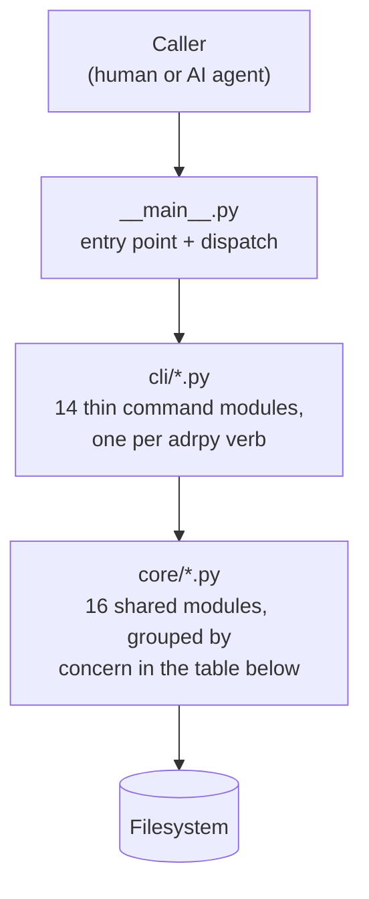
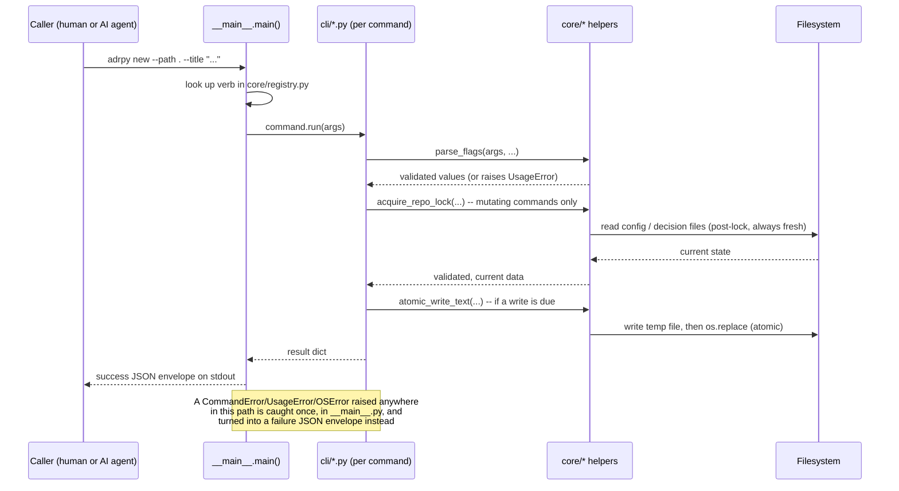
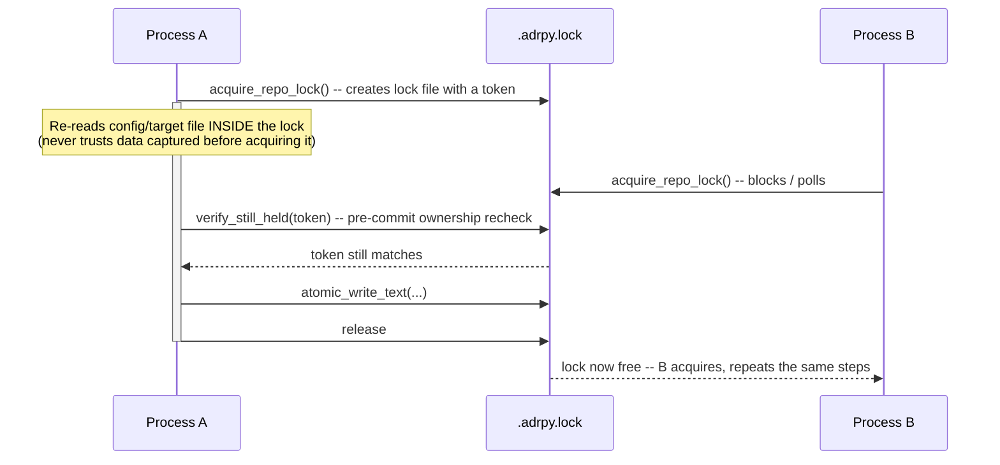
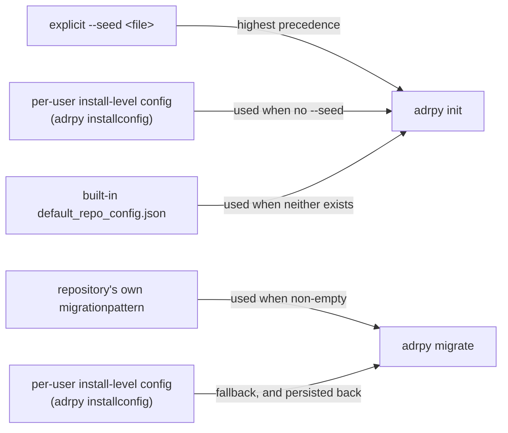
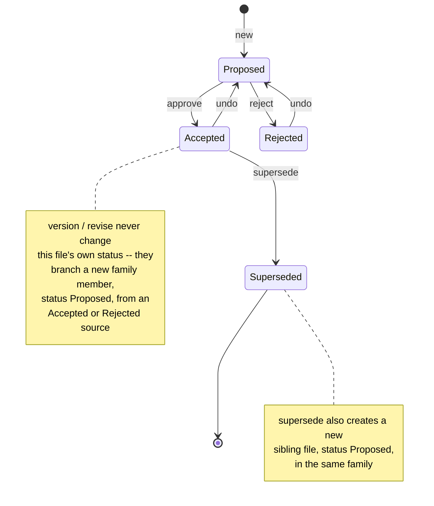

[← README](../README.md)

# Architecture

This page explains how `adrpy-ai` is put together and why: the module
layout, the request lifecycle, the two load-bearing architectural
decisions (the repository lock and the install-level config), and the
decision lifecycle the whole tool exists to manage. For the individual
command contracts, see [`doc/commands/`](commands/INDEX.md); for the
project's own recorded architectural decisions and their full rationale,
see [`doc/adr/`](adr/) and [`doc/decision-log/`](decision-log/INDEX.md) --
this page summarizes and links to them, it does not replace them.

## Why this project exists

`adrpy-ai` manages [Architecture Decision Records](https://adr.github.io/)
from the command line, built around three constraints stated directly in
its own package metadata and carried consistently through every command:

- **JSON in, JSON out, no wizard.** Every command is fully driven by
  flags and returns a single JSON object on stdout -- nothing waits for a
  keypress. This is not a UX preference; it is what makes the tool safe
  to script and safe for an AI agent to call without a human in the loop.
- **Self-documenting.** `adrpy help <command>` returns the exact same
  structured contract (arguments, types, failure codes) a human reads in
  `doc/commands/` -- the documentation and the code cannot silently drift
  apart, because the per-command pages in this repository are generated
  directly from that same `describe()` output, not written independently
  of it.
- **Zero runtime dependencies.** Every capability -- argument parsing,
  file locking, retry logic, per-OS path resolution -- is implemented in
  `core/` rather than pulled in from a package, so the tool has no
  supply-chain surface beyond the Python standard library.

`adrpy-ai` is also a Python companion to a reference tool, AdrPlus
(C#/.NET), by the same author -- see
[Relationship to AdrPlus](../README.md#relationship-to-adrplus) in the
main README for what that relationship does and does not mean. This page
only describes `adrpy-ai`'s own architecture.

## Module map

Every command handler in `cli/` is thin: it parses its own flags, then
delegates the actual work -- locking, reading, validating, writing -- to
the shared modules in `core/`. No `core/` module ever imports from `cli/`;
the dependency direction is one-way, always downward through these four
layers:



No single command uses every `core/` module, and no `core/` module is used
by every command -- the table below is the accurate picture; the diagram
above is deliberately just the layering, not a full edge list, because a
command-by-module graph for 13 x 15 modules is a hairball no one can
actually read.

| Concern | Modules | Responsibility |
|---|---|---|
| Dispatch & contract | `registry.py`, `args.py`, `output.py`, `errors.py` | Maps each verb to its command module; parses `--flag value` pairs; builds the JSON envelope and exit code; defines `CommandError`/`UsageError`. Used by every command. |
| Concurrency & storage | `lock.py`, `atomic_write.py`, `io_retry.py` | The whole-repository advisory lock ([ADR001](adr/ADR001V01-repository-lock-covers-the-full-critical-section-of-every-mutating-command.md)); atomic, retrying file writes; the shared transient-read-retry loop both of the above lean on. |
| Configuration | `config.py`, `install_config.py` | A repository's own `adr-config.adrplus` schema; the per-user install-level config ([ADR002](adr/ADR002V01-install-level-config-is-a-per-user-file-that-seeds-init-and-migrate-instead-of-an-install-directory-template.md)). |
| Decision file mechanics | `lifecycle.py`, `header.py`, `naming.py`, `casing.py`, `security.py` | Status transitions and family scans; the 12-line header format; filename parsing/building for both naming schemes; title case transforms; path-escape guards. |
| Decision log | `decision_log.py` | The mechanical half of a decision-log entry ([ADR003V01](adr/ADR003V01-decision-log-entries-separate-human-reviewed-judgment-from-tool-executed-mechanics-via-a-future-adrpy-log-command.md)): filename/structured-line construction, `Round` allocation, and `INDEX.md` regeneration -- judgment (classification, wording) stays outside the tool, in the [decision-log workflow](decision-log-workflow.md). |
| Diagnostics | `warnings.py` | Builds the warning strings a result's `warnings` list carries for automatic, non-fatal recovery (a retried write, a reclaimed stale lock, orphan cleanup, an encoding repair). |

Every write command (`new`, `approve`, `reject`, `undo`, `supersede`,
`version`, `revise`, `migrate`, `config`, `log`) touches Concurrency &
storage; every command that reasons about existing decision files
touches Decision file mechanics; `init`/`config`/`migrate`/`installconfig`
touch Configuration; only `log` touches Decision log; every command
touches Dispatch & contract.

## Request lifecycle

Every invocation follows the same shape, regardless of which command runs.
`__main__.py` is the single place that turns any exception -- a deliberate
`CommandError`, a malformed invocation, or a genuinely unexpected `OSError`
-- into the one JSON envelope every caller can rely on, so no command
module ever needs its own top-level `try`/`except` for that purpose.



## Concurrency model

Every command that reads-then-writes shared repository state (`adr-config.adrplus`
or the decisions folder) acquires a single, whole-repository advisory lock
for its *entire* critical section -- not just the part that allocates a
number. This is [ADR001](adr/ADR001V01-repository-lock-covers-the-full-critical-section-of-every-mutating-command.md),
adopted after a reproduced defect showed the lock originally covered only
number allocation, letting two concurrent `approve`/`reject` calls on the
same file both report success with mutually exclusive outcomes.



If a lock holder is abandoned (crashed, or genuinely exceeds
`ABANDON_AFTER_SECONDS`), a waiting process reclaims it -- but the
original holder's own pre-commit ownership recheck then fails with a
distinct `lock-lost` error instead of writing, so a reclaim always
produces a clean, visible failure rather than a silent collision. `init`
is the one documented exception: a genuinely fresh `--path` (no config
yet) takes no lock at all, because the lock's own storage location does
not exist until that same call creates it -- see the ADR for why this is
an accepted, visibility-documented risk rather than an oversight.

## Configuration layering

`adrpy-ai` has two independent config scopes, and a defined precedence
between them, decided in [ADR002](adr/ADR002V01-install-level-config-is-a-per-user-file-that-seeds-init-and-migrate-instead-of-an-install-directory-template.md):



The install-level file lives at a per-user, OS-appropriate path
(`%APPDATA%\adrpy\install-config.json` on Windows,
`~/.config/adrpy/install-config.json` on Linux/macOS) -- deliberately
**not** relative to this package's own install directory, because writing
into a pip package's own install/site-packages directory is unsafe
(permissions, often shared, wiped on reinstall). Its schema is the same
full, seed-valid shape `init --seed` accepts, byte-compatible with a
repository's own `adr-config.adrplus` -- the one piece of schema
coherence this project deliberately keeps in step with the reference
tool, recorded in `core/config.py`'s own docstring.

## Decision lifecycle

Every decision file's `status_create`/`status_update` pair moves through a
small, fixed set of states, enforced by `core/lifecycle.py`'s own
eligibility checks (never inferred from a file's position on disk):



A **family** is every file sharing the same leading sequence number
(`ADR001*`): `version` starts a new major version, `revise` starts a new
wording-fix revision, and `supersede` starts a successor -- all three
create a new Proposed sibling rather than mutating the source they branch
from. `reject` on a successor also reverts its predecessor's `Superseded`
status back, undoing the `supersede` that created it, in the same
two-write operation.

## The JSON contract

Every command returns exactly one JSON object on stdout, whether it
succeeds or fails:

```json
{"success": true, "data": {"...": "..."}, "warnings": []}
```

```json
{"success": false, "code": "repository-locked", "data": {"...": "..."}, "warnings": []}
```

`code` is always a stable, documented string (`repository-locked`,
`config-already-exists`, ...), never a free-text message a caller has to
pattern-match -- the full, per-command list of codes lives inline in each
command's own [`doc/commands/`](commands/INDEX.md) page, next to the
exact condition that triggers it. `warnings` is always present, even when
empty, and carries non-fatal information about automatic recovery a
command's own dependencies performed silently (a retried write, a
reclaimed stale lock, orphaned temp-file cleanup, an encoding repair) --
information that would otherwise be discarded before it ever reached
anywhere a caller could see it.

## Where to go deeper

- [`doc/commands/`](commands/INDEX.md) -- full argument and failure-code
  reference, one page per command, generated from `describe()`.
- [`doc/adr/`](adr/) -- this project's own formal Architecture Decision
  Records, written using `adrpy-ai` itself.
- [`doc/decision-log/`](decision-log/INDEX.md) -- confirmed divergences
  from the reference tool, audit findings, and deferred/accepted
  trade-offs that did not rise to a full ADR.
- [`doc/decision-log-workflow.md`](decision-log-workflow.md) -- how to
  decide between an ADR and a decision-log entry, and how to write either.
- [README's own "Relationship to AdrPlus"](../README.md#relationship-to-adrplus)
  -- what this project shares with, and deliberately does not share with,
  its reference tool.
