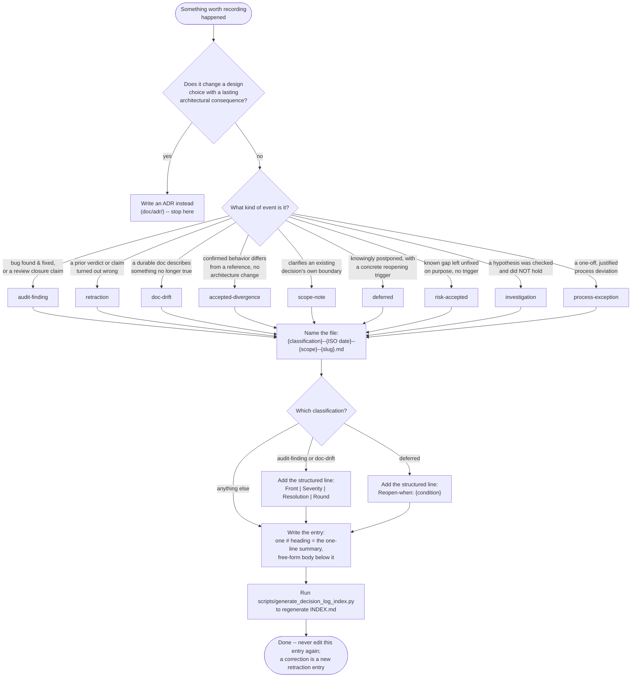

[← README](../README.md)

# Writing a decision-log entry

This page is the step-by-step workflow for adding an entry to
[`doc/decision-log/`](decision-log/INDEX.md): the lighter-weight sibling
of [`doc/adr/`](adr/), for events that are worth recording but are not an
architectural decision -- an audit finding, a retracted verdict, a
documentation-drift correction, a confirmed divergence from the reference
tool, a deferred item, an accepted trade-off, a checked-and-refuted
suspicion, or a one-off process exception. If you are looking for the
*full* classification vocabulary and the extra columns some entries carry
(`Front`/`Severity`/`Resolution`/`Round`), that lives in
[`doc/decision-log/INDEX.md`](decision-log/INDEX.md)'s own header --
this page does not repeat it, so the two never drift apart.

## Step 1: is this actually an ADR?

Ask one question before anything else: **does this change a choice among
design alternatives, with a lasting consequence for the architecture?**

- **Yes** -- this is not a decision-log entry. Open (or extend) an
  [ADR](adr/) instead, under this project's normal ADR-approval gate.
- **No** -- it's a finding, a correction, a retraction, a scoping note,
  or an accepted/deferred item. Continue below.

A clarification of what an *existing* ADR's own scope already covered is
still not a new architectural decision, even when it took real discussion
to confirm -- that's a `scope-note` entry, not a new ADR.

## Step 2: the full workflow

## The rules that don't fit in the diagram

- **No sequential numbering in the filename.** The slug (a few kebab-case
  words) is what guarantees uniqueness -- a sequential number would turn
  a gap, or an out-of-order entry, into something that misleadingly reads
  as its own finding.
- **One entry, one event, written once.** An entry is never edited to add
  a later correction -- that correction is a **new** entry, classification
  `retraction`, referencing the original entry's filename by name.
- **`scope`** reuses whatever module/command vocabulary the project
  already has (`lock`, `config`, `cli`, ...) -- never a fresh, one-off
  name invented for a single entry.
- **A cluster of entries around the same scope and concern is a signal,
  not yet a decision**, that there may be a real architectural gap
  underneath. If you notice one, propose opening an ADR that references
  the cluster as evidence, rather than continuing to add entries about
  what may be the same unresolved design question.
- **Cycles** -- a human-friendly name for a range of related entries,
  assigned only in hindsight once the span is over -- are recorded
  separately in [`doc/decision-log/CYCLES.md`](decision-log/CYCLES.md),
  never as a field on individual entries.
