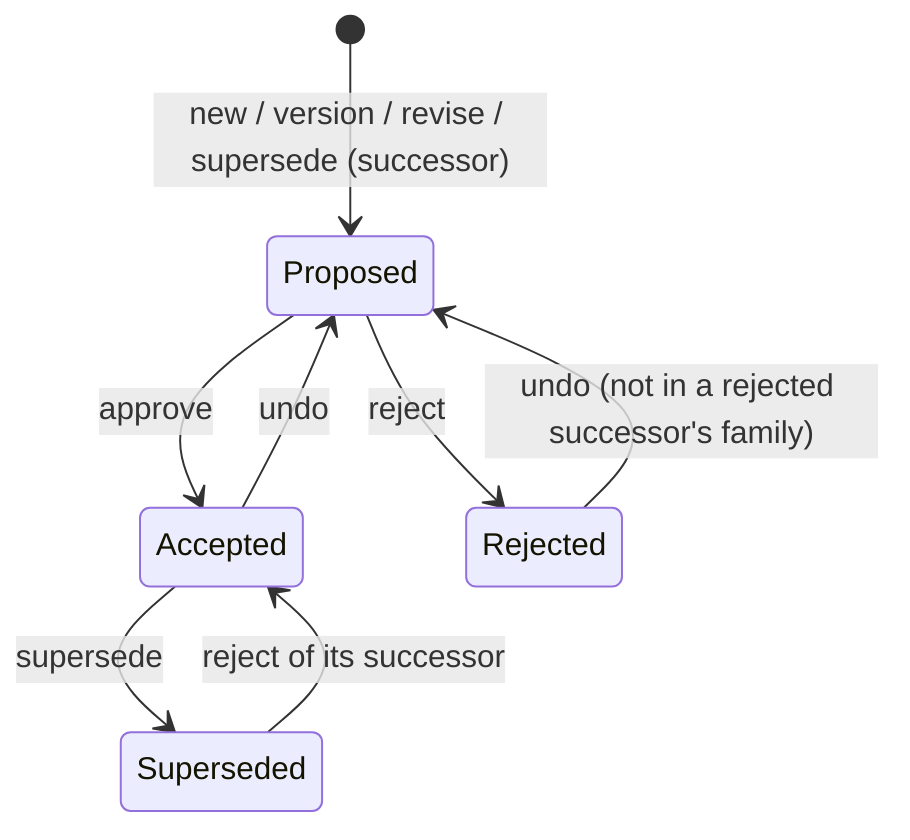

[← README](../README.md) · [Command Reference](commands/INDEX.md) · [Architecture](architecture.md)

# Decision lifecycle

Which status a decision can move to, which command moves it, and what
stops a command. Every rule here is checked by `adrpy` itself, from the
files on disk, on every call; a command that is not allowed changes no
decision file and returns the failure code named below. (Housekeeping can
still happen first: removing its own orphaned temp files, and `migrate`
persisting its fallback pattern into `adr-config.adrplus`.)

## Where status lives

A decision's header has three status cells:

| Cell | Holds | Written by |
|---|---|---|
| **Created** | `Proposed` and the creation date | `new`, `version`, `revise`, `supersede` (the successor); never changed afterwards |
| **Changed** | `Accepted` or `Rejected` and the date | `approve`, `reject`; cleared by `undo` |
| **Superseded** | `Superseded`, the date and the successor's number | `supersede` (the predecessor); cleared only by `reject` of that successor |

So a decision is **Proposed** while its Changed cell is empty, **Accepted**
or **Rejected** once it is filled, and **Superseded** once the third cell
is filled. `undo` never touches the Superseded cell.

## The one rule behind all the others

> **The filename decides identity and numbering, counting every file.
> The header decides status.**

- **Identity and numbering come from the name.** Which family a file
  belongs to, which decision a successor points back to (the `--001`
  suffix), and which sequence, version and revision numbers are taken
  are all read from filenames -- every file that matches the naming
  scheme counts, whatever its content. A number held by any file is
  never given to a second one: `new` takes the number after the highest
  one held (gaps are not reused), `revise` the revision after the
  highest one its version holds, and `version` the version after the
  highest one its family holds.
- **Status comes from the header.** Every file with an ADR name must have
  a header that parses, with a status combination the tool writes (see
  the next section). A header written by AdrPlus 1.0.0 -- the status read
  from its label, with no hidden canonical marker -- and a file `migrate`
  brought in (`<!-- Migrated -->`) both count. When a status cell has both
  the hidden marker (`<!-- Accepted -->`) and a label, the marker wins; a
  label that says otherwise is reported as a warning.
- **Encoding.** A byte that is not valid UTF-8 only matters if it breaks
  the header. One that doesn't is replaced on the next rewrite, with a
  warning. Leading BOMs are ignored.

## ADR names

A file is a decision only when its name is an **ADR name**:

```
<prefix><number>V<version>[R<revision>]<sep><title>[<sep><sep><NNN>].md
```

- `<prefix>` is the configured `prefix` (default `ADR`, possibly empty),
  compared ASCII case-insensitively: `adr001V01-x.md` is an ADR name when
  the prefix is `ADR`.
- `<number>`, `<version>` and `<revision>` are runs of ASCII digits, of any
  length (a number wider than `lenseq` still counts). `V<version>` is
  mandatory; `R<revision>` is optional. `V` and `R` may be lower case.
- `<sep>` is the configured `separator`; the title is everything after the
  first one.
- `<sep><sep><NNN>` (digits only) is the supersede suffix. It makes the
  file a successor of decision `NNN` only when `NNN` is **lower** than the
  file's own number; a suffix naming its own number or a higher one links
  to nothing, and no supersede rule reads it. Everything after a doubled
  separator is read as the suffix: a name where that part is not all
  digits, or with more than one doubled separator, is not an ADR name.
  The suffix is read only after a title, that is, when a single separator
  comes before the doubled one: `ADR002V01--001.md` has no title and is
  not an ADR name.
- The `.md` extension is compared case-insensitively (`ADR001V01-x.MD`
  counts). The folder scan follows the platform's file-name case rule,
  so on a case-sensitive file system only a lower-case `.md` is scanned.

A legacy name (`0001-use-postgres.md`) is an ADR name only through the
`migrationpattern` (see [`config`](commands/config.md)). Anything else --
a README, an index, `2024-01-15-meeting.md`, a name without the prefix or
without `V` -- is not a decision: validation and numbering ignore it
(`explore` still lists it).

A legacy name also depends on the repository's **phase**, decided on
every scan of the folder: once any file with an ADR name (either scheme)
has a valid header `migrate` did not write -- one the tool or AdrPlus
created, or one copied by hand; from then on `migrate` no longer runs
(`already-tool-created-adrs-exist`) -- a legacy name **without a header**
is not a decision anywhere: validation, numbering, the config guards and
`init`'s existing-number check ignore it, a command given it as `--file`
refuses it (`filename-not-recognized`), `explore` lists it with
`scheme: null`, and `check`, `explore` and every lifecycle command name it
in `warnings`, each with the number read from its name -- that number
may already be a decision's, so rename it to a free number before giving
it a header by hand. When `new`, `version`, `revise` or `supersede` has
just created a decision with that number, or `supersede` acts on one, the
same warning says so (`ADR002 now shares number 2 with
0002-team-offsite-notes.md`). Before
that (the repository not adopted yet), it is a decision with no header
(`no-header`, until `migrate` runs), as a hand-written repository expects:
headers `migrate` wrote do not end the adoption, so after a partial run
the files left still block every lifecycle command until `migrate`
finishes them. A 0-byte file with a legacy name counts as one without a header
(the tool only ever creates current-scheme names, so it is never an
interrupted create's). A header that looks like this tool's but does not
parse never adopts the repository, and stays `invalid-header` in both
phases; a legacy name with a valid header is a decision in both. `migrate`
still finds every legacy name, so a re-run after a partial `migrate`
migrates what is left.

## Validate the whole repository before acting

Every lifecycle command -- `new`, `approve`, `reject`, `undo`,
`supersede`, `version` and `revise` -- first validates the whole
decisions folder, and `config` does the same before changing a guarded
field (`folderadr`, `folderlog`, a status label, `separator`, `prefix`,
`migrationpattern`). If any rule below is broken, the command fails with
`repository-inconsistent` and writes nothing: `data.errors` lists every
broken rule, sorted by file, each as `{code, file, related_files, detail,
hint}`, the `hint` saying how to repair it. `adrpy check` runs the same
validation on its own and changes nothing.

`adrpy` does not repair a repository: every broken rule is fixed by hand
(or by restoring the file from git), then the command is run again.

What is validated:

- every file with an ADR name (see above) anywhere under the decisions
  folder (`folderadr`), subdirectories included, less the legacy names
  without a header of an adopted repository (the phase rule above). A
  `.md` whose name is not an ADR name is not a decision and is ignored,
  except that `check` and `explore` warn about one whose name starts with
  a digit (as in `0001-use-x.md`), most likely a decision written before
  adrpy, and about each legacy name the phase rule leaves out;
- a file-targeted command (`--file`) acts only on a decision inside the
  decisions folder: any other file is refused with
  `target-outside-folderadr`.

The rules, one error code each:

| Rule | `data.errors[].code` |
|---|---|
| No git merge-conflict marker line (starting `<<<<<<< ` or `>>>>>>> `) in the 12 header lines -- checked first, and reported alone for that file. The file keeps its name, so it still holds its number (`duplicate-number`, the next number), but it has no status: the family rules skip it, and a supersede link to or from it is not reported broken while the conflict lasts | `merge-conflict-markers` |
| Every file with an ADR name has a header -- for a legacy name, only while the repository is not adopted yet (see ADR names) -- (the hint points at `migrate` for a file that predates the tool) | `no-header` |
| The header parses: every row has exactly its two cells (an extra `\|` makes the row invalid), and the title, scope and domain have no `\|` and no line-break-like character (the title also no filesystem-unsafe character and not only whitespace, `_` or `-`); `detail` names the reason | `invalid-header` |
| The Created/Changed/Superseded cells form a combination the tool writes (below) | `invalid-status-combination` |
| No two files share number, version and revision (a missing revision counts as 0) | `duplicate-number` |
| At most one open `Proposed` member per family (a migrated placeholder is not one) | `pending-duplicate` |
| An open `Proposed` member is the live member of its family | `pending-not-live` |
| At most one `Superseded` member per family | `superseded-duplicate` |
| A `Superseded` member is the live member of its family | `superseded-not-live` |
| A `Superseded` cell points at a successor that exists, is not `Rejected`, and names this decision in its `--NNN` filename suffix | `superseded-without-successor` |
| A successor that is not `Rejected` has a predecessor whose `Superseded` cell points back at it | `successor-without-predecessor` |
| A predecessor has at most one successor that is not `Rejected` | `multiple-live-successors` |
| In the family of a `Rejected` successor, every member is `Rejected` (a rejected successor ends its whole family) | `rejected-successor-family-not-final` |
| Every directory and decision file under the decisions folder can be read | `scan-incomplete` |

A rule broken by several files together -- `duplicate-number`,
`pending-duplicate`, `superseded-duplicate`, `multiple-live-successors` --
gives one entry, on the first of those files in sort order, with the
others in `related_files`. Every other rule gives one entry per file that
breaks it.

"Live" is the first family rule below: the family's latest member, newer
members that are all `Rejected` not counting.

The status combinations the tool writes (Created / Changed / Superseded;
-- is a blank cell):

| Created | Changed | Superseded | Status |
|---|---|---|---|
| Proposed | -- | -- | Proposed |
| Proposed | Accepted | -- | Accepted |
| Proposed | Rejected | -- | Rejected |
| Proposed | Accepted | Superseded | Superseded |
| -- | -- | -- | migrated placeholder |
| -- | Accepted | -- | Accepted (migrated) |
| -- | Rejected | -- | Rejected (migrated) |
| -- | Accepted | Superseded | Superseded (migrated) |
| -- | -- | Superseded | Superseded (migrated placeholder) |

A blank Created cell is valid only on a migrated file.

Not every command validates. `explore` is the inventory: it lists every
file, and reports the same errors in `consistency.errors` while still
succeeding. `help`, `init`, `installconfig` and `log` do not act on
existing decisions and do not validate. `config` validates only when it
changes a guarded field, and tolerates `no-header` (it is how
`migrationpattern` is set before migrating). `migrate` writes decision files
but does not validate either: it is what brings a hand-written
repository to a state that validates (see Migrated decisions below).

## Families

A **family** is every decision sharing the same sequence number:
`ADR001V01` and `ADR001V02` (or, with revisions configured, `ADR001V01R01`,
`ADR001V01R02`, `ADR001V02R01`) are one family. `version` (a new major
version) and `revise` (a wording fix, when revisions are configured) add
a member to the same family. `supersede` starts a new family under the
next number, whose filename ends with the predecessor's number
(`ADR002V01-title--001.md`).

## State diagram



`Superseded` is final for every command except one: rejecting the
successor that `supersede` created puts the predecessor back to where it
was (`Accepted`, or a migrated placeholder again). The rejected
successor's whole family is then the end of its line.

## What each command requires

Every command below also requires the target not to be locked by a newer
member of its family (see the family rules).

| Command | The target must be | The family must not have | Result |
|---|---|---|---|
| `new` | -- (takes `--path`) | -- | A new family, `V01`, `Proposed`, under the next number. The title must be unique in the repository after case-transform normalization (`title-already-exists`). |
| `approve` | `Proposed` (or a migrated placeholder) | a `Superseded` member | Target `Accepted`. |
| `reject` | `Proposed` (or a migrated placeholder) | a `Superseded` member | Target `Rejected`. If the target is a successor, its predecessor goes back first (see below). |
| `undo` | `Accepted` or `Rejected`, and not in a rejected successor's family | a `Superseded` member; another `Proposed` member | Target back to `Proposed`. |
| `supersede` | `Accepted` (or a migrated placeholder) | a `Superseded` member; a `Proposed` member | A successor, `Proposed`, in a new family; then the target `Superseded`. |
| `version` | `Accepted` or `Rejected` (or a migrated placeholder), and not in a rejected successor's family | a `Superseded` member; a `Proposed` member | A new major version, `Proposed`, in the same family; scope and domain default to the target's. |
| `revise` | `Accepted` or `Rejected` (or a migrated placeholder), and not in a rejected successor's family | a `Superseded` member; a `Proposed` member | A new revision of the target's version, `Proposed`. Needs `lenrevision > 0`. |

When the target's own status does not fit, the code says which status it
has: `still-proposed`, `already-accepted`, `already-rejected` or
`already-superseded`. The family rules fail with
`family-member-superseded`, `family-member-pending`,
`not-latest-version` and `rejected-successor-is-final`.

The checks run in a fixed order, and only the first one that fails is
reported:

1. The target: it exists, has an ADR name (`filename-not-recognized`) and
   is inside the decisions folder (`target-outside-folderadr`).
2. The whole repository (`repository-inconsistent`).
3. `revise` only: `revision-not-configured` (`lenrevision` is 0).
4. The target's own status.
5. The family rules the command has, in this order:
   `family-member-superseded`, `family-member-pending`,
   `not-latest-version`, `rejected-successor-is-final`.
6. `--refdate`, then the title, scope and domain values.
7. The new number, last: `version` and `revise`, the new version or
   revision must fit `lenversion` / `lenrevision`; `supersede`, the
   successor's number must fit `lenseq`
   (`lenseq-too-small-for-new-number`).

`new` checks the repository, then its title, scope and domain values and
`--refdate`, then `title-already-exists`, and the number
(`lenseq-too-small-for-new-number`) last. A number that does not fit says
which `adrpy config --lenseq` / `--lenversion` / `--lenrevision` widens
it, or that the field is already at its maximum.

`config` does not guard these three fields: narrowing `lenseq`,
`lenversion` or `lenrevision` below a number already on disk succeeds,
and `check` still passes (a wider number is still an ADR name). The
mismatch shows up at the next command that numbers a new file -- `new`
or `supersede` for `lenseq`, `version` for `lenversion`, `revise` for
`lenrevision`. Only `init` (with or without `--seed`) checks the numbers
already on disk against them.

## Family rules, in short

1. **Only the latest member is alive.** A newer version locks every
   member of an older version, and a newer revision locks the older
   revisions of the same version -- unless every newer one is `Rejected`:
   rejected attempts never lock what came before them. A locked member
   can't change at all: every command refuses
   it -- with `not-latest-version`, naming the newer file, once the
   target's own status check has passed (an Accepted locked member asked
   to `approve` still says `already-accepted`).

   | Family | Not locked |
   |---|---|
   | V01 Accepted, V02 Accepted (or Proposed) | V02 |
   | V01 Accepted, V02 Rejected | V01 and V02 |
   | V01 Accepted, V02 Rejected, V03 Rejected | V01, V02 and V03 |
   | V01, V02 Rejected, V03 Accepted (or Proposed) | V03 |
   | V01R01 Accepted, V01R02 Rejected | V01R01 and V01R02 |
   | V01R02 Accepted, V02R01 Accepted | V02R01 |

   The all-Rejected exception is checked separately for newer versions
   and for newer revisions of the target's own version.

2. **A superseded family is frozen.** Once any member is `Superseded`, no
   command acts on any member of that family (`family-member-superseded`;
   `data.superseded_file` names it).
   The one way back is `reject` of the successor -- of its first member,
   the one whose filename carries the `--NNN` suffix, while that member is
   still not locked. Once the successor has moved on -- a newer version or
   revision of it that is not `Rejected` -- the supersede is settled: the
   predecessor does not come back while that member stands, and the line
   continues from the successor's latest member. Rejecting those newer
   members unlocks the first one again.
3. **At most one open member per family.** `undo`, `supersede`, `version`
   and `revise` refuse while another member is still `Proposed`
   (`family-member-pending`; `data.pending_file` names it). `approve` and
   `reject` are what close that open member.
4. **A rejected successor is the end of its line.** Once a successor (its
   filename carries a `--NNN` suffix) is `Rejected`, no member of its
   family -- including versions made from it, which carry no suffix --
   can be undone, versioned or revised (`rejected-successor-is-final`;
   `data.successor_file` and `data.predecessor_number` say which); supersede
   the predecessor again for a new successor.

## `supersede` and `reject` together

`supersede` and `reject` of a successor each write two files. Both files
are prepared first -- the complete new content in a temp file next to
each -- and only then written, in a fixed order. There is no resume
step: a write that stops halfway leaves a repository the validator
refuses, repaired by hand once.

`supersede` writes the successor first, then the predecessor:

1. It creates the successor, `Proposed`, in a new family (never over an
   existing file: `file-already-exists`).
2. It marks the predecessor `Superseded`, pointing at the successor's
   number.

A failure preparing either file, or creating the successor, writes
nothing (`supersede-successor-write-failed`). If step 2 fails, the
successor exists and the predecessor is still `Accepted`: the command
fails with `multi-file-write-partially-applied`, `data.applied` naming
the successor, `data.pending` the predecessor, and `data.repair`
(`{file, row}`) the exact header row to put in the predecessor. Until
then the repository breaks `successor-without-predecessor` and every
command refuses it. Repair it by hand: put `data.repair`'s row in the
predecessor, or remove the successor (just created from the template)
and run `supersede` again.

`reject` on a successor writes the predecessor first:

1. It reverts the predecessor's `Superseded` cell, putting it back where
   it was.
2. It marks the successor `Rejected` -- the end of its family's line.

A failure before the predecessor is written writes nothing
(`reject-predecessor-write-failed`), and the call can simply be run
again. If step 2 fails, the command fails with
`multi-file-write-partially-applied` (`data.applied`: the predecessor,
`data.pending` and `data.repair`: the successor and its `Rejected`
Changed row); the repository then breaks
`successor-without-predecessor` until that row is put in the successor
by hand.

An interrupt (Ctrl+C) after the first file is written fails with
`interrupted` and the same `data` (`applied`, `pending`, `repair`) as
`multi-file-write-partially-applied`; an interrupt before it has written
nothing and carries no `data`.

`reject` only reverts a `Superseded` cell that names this successor
(compared as a number, so a later `lenseq` change doesn't matter).

## Dates

`new`, `approve`, `reject`, `supersede`, `version` and `revise` take an
optional `--refdate` (default: today). Give it as `YYYY-MM-DD` (other ISO
8601 date forms Python's `date.fromisoformat` accepts are tolerated); it
must not be in the future (`refdate-invalid-format`, `refdate-in-future`),
and not before the latest date the decision it builds on already carries
(`refdate-before-history`):

| Command | Not before |
|---|---|
| `new` | -- |
| `approve`, `reject` | the target's creation date |
| `supersede`, `version`, `revise` | the target's Changed date (or its creation date) |

`undo` takes no date: it clears the Changed cell.

## Migrated decisions

`migrate` brings hand-written decisions under the tool with a header
whose status cells are blank. Such a **migrated placeholder** counts as
`Proposed` for `approve`/`reject`, and as already decided for
`supersede`, `version` and `revise`, so an old chain can be continued
without inventing dates. `undo` needs a real Changed status and refuses
it (`still-proposed`), and a placeholder never counts as the family's
open `Proposed` member. `undo` of a migrated decision that was accepted
or rejected clears its Changed cell, which makes it a placeholder again:
its result's `status` is `null`, not `"Proposed"`. Placeholders follow the family rules like any
other member: a migrated `V01` with a migrated `V02` next to it is locked.
`migrate`, like `init`, does not validate the repository first -- it is
what brings a repository to a state that validates.

`migrate` always needs a `migrationpattern`: the repository's own, or
the install-level fallback, which it then saves into the repository's
config. It needs one even when every file already has an ADR name (the
ADR name is read first). The pattern also makes a decision of every
other name it matches -- a dated note -- a decision while the repository
is not adopted yet, that is while `migrate` can still run (after that,
one without a header is ignored and warned about: see ADR names), so choose one that matches nothing else in
the folder. `adrpy explore --path . --migrationpattern <pattern>` previews
what a pattern reads from each name (`migrationpattern_preview`, the list
`config --migrationpattern` returns, with the same misreading warnings)
without writing anything; `adrpy config --migrationpattern` then writes
it, and `check` fails with `no-header` on each matched file until
`migrate` runs. A pattern that reads part of a name twice -- its T (title
start) inside its N, V, R or P range, or two of those ranges overlapping,
as `N00:04T02` for `0001-use-x.md`, which would record the title
`01-use-x` -- is refused with `config-migrationpattern-invalid` wherever
it is set (`config`, `installconfig`, `init --seed` or the install-level
config `init` reads, `explore`'s preview), and `migrate` refuses it before
writing anything (a fallback before it is persisted). A config that
already holds one still loads, and the pattern can be cleared or
corrected as the next rule allows. A pattern
set by mistake can be changed or cleared (`adrpy config
--migrationpattern ""`) only while no legacy-scheme decision with a valid
header exists -- that is, one already migrated. A legacy name the pattern
matches that has no header yet does not count: the pattern can still be
fixed before `migrate` runs. Once a migrated legacy decision exists,
every change is refused
(`status-or-separator-change-blocked-by-existing-decisions`). `migrate` refuses the whole run, checking
in this order:

1. a file that looks like this tool's header but does not parse
   (`migration-invalid-headers-exist`), then a file with a valid header
   `migrate` did not write -- AdrPlus's or adrpy's
   (`already-tool-created-adrs-exist`); both before the pattern is needed;
2. no pattern (`migration-pattern-not-configured`);
3. a file or directory it cannot read (`migration-scan-failed`,
   `migration-scan-incomplete`), then no decision at all
   (`no-decisions-found`);
4. the two header checks of step 1 again, over the names the pattern adds;
5. a file that already carries a supersede suffix (`--NNN`, whatever its
   number; `migration-successor-files-exist`): a supersede chain is
   something only this tool creates -- rename the file without the
   suffix, migrate, then record the chain with `supersede`;
6. files sharing number, version and revision
   (`migration-duplicate-numbers-exist`);
7. nothing left to migrate (`no-eligible-files-to-migrate`).

The refusals about specific files (steps 1, 4, 5 and 6) name them in
`data.files`.

See each command's page in the [Command Reference](commands/INDEX.md)
for its full list of failure codes.
