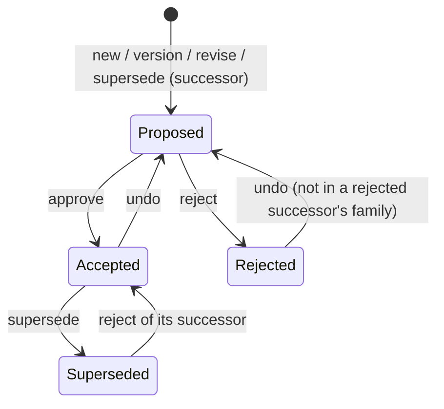

[← README](../README.md) · [Command Reference](commands/INDEX.md) · [Architecture](architecture.md)

# Decision lifecycle

Which status a decision can move to, which command moves it, and what
stops a command. Every rule here is checked by `adrpy` itself, fresh,
under the repository lock; a command that is not allowed changes no
decision file and returns the failure code named below. (Housekeeping can
still happen first: removing its own orphaned temp files, and `migrate`
persisting its fallback pattern into `adr-config.adrplus`.)

## Where status lives

A decision's header has three status cells:

| Cell | Holds | Written by |
|---|---|---|
| **Created** | `Proposed` and the creation date | `new`, `version`, `revise`, `supersede` (the successor); never changed afterwards |
| **Changed** | `Accepted` or `Rejected` and the date | `approve`, `reject`; cleared by `undo` |
| **Superseded** | `Superseded`, the date and the successor's number | `supersede` (the predecessor); cleared only by `reject` of that successor |

So a decision is **Proposed** while its Changed cell is empty, **Accepted**
or **Rejected** once it is filled, and **Superseded** once the third cell
is filled. `undo` never touches the Superseded cell.

## The one rule behind all the others

> **The filename decides identity and numbering, counting every file.
> The header decides status, counting only headers that parse.**

- **Identity and numbering come from the name.** Which family a file
  belongs to, which decision a successor points back to (the `--001`
  suffix), and which sequence, version and revision numbers are taken
  are all read from filenames -- every file that matches the naming
  scheme counts, whatever its content. A number held by any file is
  never given to a second one: `new` takes the number after the highest
  one held (gaps are not reused), `revise` the revision after the
  highest one its version holds, and `version` refuses with
  `file-already-exists` when the version it would create is already held.
- **Status comes from the header, and only a header that parses.** A
  file whose header does not parse -- damaged by hand, broken by invalid
  bytes, re-encoded as UTF-16, or never given one -- has no status
  `adrpy` can read, so it is **invalid**: no command changes it, a
  command aimed at it refuses and says why, and the family rules below
  see only the valid members. Every command that left one out says so in
  `warnings` (`<path>: ignored -- its header does not parse (<reason>);
  see explore.`), and `explore` lists it with `header.state` and
  `header.invalid_reason` (its other header fields are then partial and
  not to be trusted).
- **What this does not prevent.** A family made inconsistent by an edit
  outside the tool -- two live decisions after a hand-broken `Superseded`
  cell -- is not blocked: `adrpy` guarantees consistency only among
  valid files, and makes the invalid ones visible. Repair or remove an
  invalid file by hand; a legacy file that never had a header is what
  `migrate` is for, as long as no decision was created by the tool yet.
- **Where it refuses instead.** `supersede` refuses when a file pointing
  back at the decision (by its suffix) is invalid, and `reject` refuses
  when it cannot find the predecessor by its back-reference and a file of
  the predecessor's family is invalid -- they depend on a status they
  cannot read, so they name the file rather than guess.
- **Not the same as unreadable.** A file or folder the tool cannot read at
  all (permission denied, and similar) is an OS error, not an invalid
  file: the command fails and reports it (`explore` alone lists what it
  can and reports the rest in `warnings`).
- **Encoding.** A byte that is not valid UTF-8 only makes a file invalid
  if it breaks the header. One that doesn't is replaced on the next
  rewrite, with a warning. Leading BOMs are ignored.

## Families

A **family** is every decision sharing the same sequence number:
`ADR001V01` and `ADR001V02` (or, with revisions configured, `ADR001V01R01`,
`ADR001V01R02`, `ADR001V02R01`) are one family. `version` (a new major
version) and `revise` (a wording fix, when revisions are configured) add
a member to the same family. `supersede` starts a new family under the
next number, whose filename ends with the predecessor's number
(`ADR002V01-title--001.md`).

## State diagram

`Superseded` is final for every command except one: rejecting the
successor that `supersede` created puts the predecessor back to where it
was (`Accepted`, or a migrated placeholder again). The rejected
successor's whole family is then the end of its line.

## What each command requires

Every command below also requires the target not to be locked by a newer
member of its family (see the family rules).

| Command | The target must be | The family must not have | Result |
|---|---|---|---|
| `new` | -- (takes `--path`) | -- | A new family, `V01`, `Proposed`, under the next number. The title must be unique in the repository after case-transform normalization (`title-already-exists`). |
| `approve` | `Proposed`, and not in the family of an unfinished supersede's successor | a `Superseded` member | Target `Accepted`. |
| `reject` | `Proposed` | a `Superseded` member | Target `Rejected`. If the target is a successor, its predecessor goes back first (see below). |
| `undo` | `Accepted` or `Rejected` (any Changed value), and not in a rejected successor's family | a `Superseded` member; another `Proposed` member | Target back to `Proposed`. |
| `supersede` | `Accepted` | a `Superseded` member; a `Proposed` member | A successor, `Proposed`, in a new family; then the target `Superseded`. |
| `version` | `Accepted` or `Rejected`, and not in a rejected or unfinished successor's family | a `Superseded` member; a `Proposed` member | A new major version, `Proposed`, in the same family; scope and domain default to the target's. |
| `revise` | `Accepted` or `Rejected`, and not in a rejected or unfinished successor's family | a `Superseded` member; a `Proposed` member | A new revision of the target's version, `Proposed`. Needs `lenrevision > 0`. |

When the target's own status does not fit, the code says which status it
has: `not-proposed`, `still-proposed`, `already-accepted`,
`already-rejected`, `already-superseded`, or `unexpected-status` for a
cell holding something no command writes. The family rules fail with
`family-member-superseded`, `family-member-pending`,
`not-latest-version`, `rejected-successor-is-final` and
`supersede-not-finished`.

## Family rules, in short

1. **Only the latest member is alive.** A newer version locks every
   member of an older version, and a newer revision locks the older
   revisions of the same version -- unless every newer one is `Rejected`:
   rejected attempts never lock what came before them. A locked member
   can't change at all: every command refuses
   it -- with `not-latest-version`, naming the newer file, once the
   target's own status check has passed (an Accepted locked member asked
   to `approve` still says `already-accepted`).

   | Family | Not locked |
   |---|---|
   | V01 Accepted, V02 Accepted (or Proposed) | V02 |
   | V01 Accepted, V02 Rejected | V01 and V02 |
   | V01 Accepted, V02 Rejected, V03 Rejected | V01, V02 and V03 |
   | V01, V02 Rejected, V03 Accepted (or Proposed) | V03 |
   | V01R01 Accepted, V01R02 Rejected | V01R01 and V01R02 |
   | V01R02 Accepted, V02R01 Accepted | V02R01 |

   The all-Rejected exception is checked separately for newer versions
   and for newer revisions of the target's own version.

2. **A superseded family is frozen.** Once any member is `Superseded`, no
   command acts on any member of that family (`family-member-superseded`;
   `data.superseded_file` names it).
   The one way back is `reject` of the successor -- of its first member,
   the one whose filename carries the `--NNN` suffix, while that member is
   still not locked. Once the successor has moved on -- a newer version or
   revision of it that is not `Rejected` -- the supersede is settled: the
   predecessor does not come back while that member stands, and the line
   continues from the successor's latest member. Rejecting those newer
   members unlocks the first one again.
3. **At most one open member per family.** `undo`, `supersede`, `version`
   and `revise` refuse while another member is still `Proposed`
   (`family-member-pending`; `data.pending_file` names it). `approve` and
   `reject` are what close that open member.
4. **A rejected successor is the end of its line.** Once a successor (its
   filename carries a `--NNN` suffix) is `Rejected`, no member of its
   family -- including versions made from it, which carry no suffix --
   can be undone, versioned or revised (`rejected-successor-is-final`;
   `data.successor_file` and `data.predecessor_number` say which); supersede
   the predecessor again for a new successor.

## `supersede` and `reject` together

`supersede` writes two files, successor first:

1. It creates the successor, `Proposed`, in a new family.
2. It marks the predecessor `Superseded`, pointing at the successor's
   number.

If step 2 fails, the successor exists and the predecessor is still
`Accepted` (`supersede-write-failed`). Run `supersede --resume` on the
predecessor to finish -- until then the successor can't be approved,
versioned or revised (`supersede-not-finished`), only rejected; without `--resume`, `supersede` refuses
(`supersede-successor-already-exists`) instead of creating a second
successor. Only a file with a higher number than the predecessor counts
as its successor, and a rejected one never does.

`reject` on a successor also writes two files, predecessor first:

1. It reverts the predecessor's `Superseded` cell, putting it back where
   it was.
2. It marks the successor `Rejected` -- the end of its family's line.

If step 2 fails (`reject-own-write-failed-after-predecessor-reverted`),
running `reject` again completes it -- unless a file of the predecessor's
family has a header that does not parse, which makes it refuse until that
file is repaired or removed. `reject` only reverts a `Superseded` cell
that names this successor (compared as a number, so a later `lenseq`
change doesn't matter); if the predecessor's family is marked
`Superseded` by another successor, it refuses
(`superseded-predecessor-not-found`).

## Dates

`new`, `approve`, `reject`, `supersede`, `version` and `revise` take an
optional `--refdate` (default: today). Give it as `YYYY-MM-DD` (other ISO
8601 date forms Python's `date.fromisoformat` accepts are tolerated); it
must not be in the future (`refdate-invalid-format`, `refdate-in-future`),
and not before the latest date the decision it builds on already carries
(`refdate-before-history`):

| Command | Not before |
|---|---|
| `new` | -- |
| `approve`, `reject` | the target's creation date |
| `supersede` | the target's Changed date (or its creation date); with `--resume`, also the existing successor's creation date |
| `version`, `revise` | the target's Changed date (or its creation date) |

`undo` takes no date: it clears the Changed cell.

## Migrated decisions

`migrate` brings hand-written decisions under the tool with a header
whose status cells are blank. Such a **migrated placeholder** counts as
`Proposed` for `approve`/`reject`, and as already decided for
`supersede`, `version` and `revise`, so an old chain can be continued
without inventing dates. `undo` needs a real Changed status and refuses
it (`still-proposed`), and a placeholder never counts as the family's
open `Proposed` member. Placeholders follow the family rules like any
other member: a migrated `V01` with a migrated `V02` next to it is locked.

A supersede chain is something only this tool creates. `migrate` refuses
the whole run when a file already carries a supersede suffix (`--NNN`,
`migration-successor-files-exist`, `data.files`): rename it without the
suffix, migrate, then record the chain with `supersede`.

See each command's page in the [Command Reference](commands/INDEX.md)
for its full list of failure codes.
