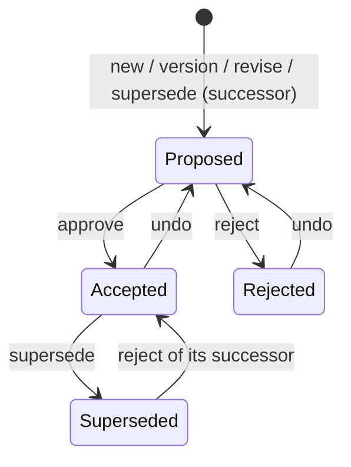

[← README](../README.md) · [Command Reference](commands/INDEX.md) · [Architecture](architecture.md)

# Decision lifecycle

Which status a decision can move to, which command moves it, and what
stops a command. Every rule here is checked by `adrpy` itself, fresh,
under the repository lock; a command that is not allowed changes nothing
and returns the failure code named below.

## Where status lives

A decision's header has three status cells, and each is written once:

| Cell | Holds | Written by |
|---|---|---|
| **Created** | `Proposed` and the creation date | `new`, `version`, `revise`, `supersede` (the successor) |
| **Changed** | `Accepted` or `Rejected` and the date | `approve`, `reject`; cleared by `undo` |
| **Superseded** | `Superseded`, the date and the successor's number | `supersede` (the predecessor); cleared only by `reject` of that successor |

So a decision is **Proposed** while its Changed cell is empty, **Accepted**
or **Rejected** once it is filled, and **Superseded** once the third cell
is filled. `undo` never touches the Superseded cell.

## The one rule behind all the others

> **The filename decides identity and numbering, counting every file.
> The header decides status, counting only headers that parse.**

- **Identity and numbering come from the name.** Which family a file
  belongs to, which decision a successor points back to (the `--001`
  suffix), and which sequence, version and revision numbers are taken
  are all read from filenames -- every file that matches the naming
  scheme counts, whatever its content. A number held by any file is
  never given to a second one: `new` takes the next free sequence number,
  and `version`/`revise` refuse with `file-already-exists` when the
  number they would create is already held.
- **Status comes from the header, and only a header that parses.** A
  file whose header does not parse -- damaged by hand, broken by invalid
  bytes, or never given one -- has no status `adrpy` can read, so it is
  **invalid**: no command changes it, a command aimed at it refuses and
  says why, and the family rules below see only the valid members.
  Every command that left one out says so in `warnings`
  (`<file>: ignored -- its header does not parse (<reason>)`), and
  `explore` lists it with the reason.
- **What this does not prevent.** A family made inconsistent by an edit
  outside the tool -- two live decisions after a hand-broken `Superseded`
  cell -- is not blocked: `adrpy` guarantees consistency only among
  valid files, and makes the invalid ones visible. Repair or remove an
  invalid file by hand.
- **Where it refuses instead.** Two writes depend on another family's
  status: `reject` reverting a successor's predecessor, and `supersede`
  looking for an earlier successor that points back. When a file they
  depend on is invalid, they refuse and name it rather than guess.
- **Not the same as unreadable.** A file or folder the tool cannot read at
  all (permission denied, and similar) is an OS error, not an invalid
  file: the command fails and reports it.
- **Encoding.** A byte that is not valid UTF-8 only makes a file invalid
  if it breaks the header. One that doesn't is replaced on the next
  rewrite, with a warning. A leading BOM is ignored.

## Families

A **family** is every decision sharing the same sequence number:
`ADR001V01`, `ADR001V02`, `ADR001V02R01` are one family. `version` (a new
major version) and `revise` (a wording fix, when revisions are
configured) add a member to the same family. `supersede` starts a new
family under the next free number, whose filename ends with the
predecessor's number (`ADR002V01-title--001.md`).

## State diagram

`Superseded` is final for every command except one: rejecting the
successor that `supersede` created puts the predecessor back to
`Accepted`.

## What each command requires

| Command | The target must be | The family must not have | Result |
|---|---|---|---|
| `new` | -- (takes `--path`) | -- | A new family, `V01`, `Proposed`, under the next free number. The title must be unique in the repository (`title-already-exists`). |
| `approve` | `Proposed` | a `Superseded` member | Target `Accepted`. |
| `reject` | `Proposed` | a `Superseded` member | Target `Rejected`. If the target is a successor, its predecessor goes back to `Accepted` first (see below). |
| `undo` | `Accepted` or `Rejected` | a `Superseded` member; another `Proposed` member | Target back to `Proposed`. |
| `supersede` | `Accepted` | a `Superseded` member; a `Proposed` member | A successor, `Proposed`, in a new family; then the target `Superseded`. |
| `version` | `Accepted` or `Rejected`, and the latest member of its family (or an older one, when the latest is `Rejected`) | a `Superseded` member; a `Proposed` member | A new major version, `Proposed`, in the same family. |
| `revise` | `Accepted` or `Rejected`, and the latest member of its family (or an older one, when the latest is `Rejected`) | a `Superseded` member; a `Proposed` member | A new revision, `Proposed`, in the same family. Needs `lenrevision > 0`. |

When the target's own status does not fit, the code says which status it
has: `not-proposed`, `still-proposed`, `already-accepted`,
`already-rejected`, `already-superseded`, or `unexpected-status` for a
cell holding something no command writes. The family rules fail with
`family-member-superseded`, `family-member-pending` and
`not-latest-version`.

## Family rules, in short

1. **A superseded family is frozen.** Once any member is `Superseded`, no
   command acts on any member of that family (`family-member-superseded`).
   The one way back is `reject` of the successor.
2. **At most one open member per family.** `undo`, `supersede`, `version`
   and `revise` refuse while another member is still `Proposed`
   (`family-member-pending`). `approve` and `reject` are what close that
   open member.
3. **New versions branch from the latest.** `version` and `revise` start
   from the family's highest version/revision (`not-latest-version`
   otherwise); the one exception is branching off an older member when
   the latest was `Rejected`. The number they would create must be free:
   if any file already holds it, they refuse (`file-already-exists`).

## `supersede` and `reject` together

`supersede` writes two files, successor first:

1. It creates the successor, `Proposed`, in a new family.
2. It marks the predecessor `Superseded`, pointing at the successor's
   number.

If step 2 fails, the successor exists and the predecessor is still
`Accepted` (`supersede-write-failed`). Run `supersede --resume` on the
predecessor to finish; without `--resume`, `supersede` refuses
(`supersede-successor-already-exists`) instead of creating a second
successor. Only a file with a higher number than the predecessor counts
as its successor.

`reject` on a successor also writes two files, predecessor first:

1. It reverts the predecessor's `Superseded` cell, so the predecessor is
   `Accepted` again.
2. It marks the successor `Rejected`.

If step 2 fails (`reject-own-write-failed-after-predecessor-reverted`),
running `reject` again completes it -- unless a file of the predecessor's
family has a header that does not parse, which makes it refuse until that
file is repaired or removed. `reject` only reverts a `Superseded`
cell that names this successor; if the predecessor's family is marked
`Superseded` by another successor, it refuses
(`superseded-predecessor-not-found`).

`undo` on a successor changes only the successor. After
`reject` + `undo` of a successor, it is `Proposed` again and still
points at a predecessor that is `Accepted`; `supersede` then refuses
until you reject it or `--resume` onto it.

## Dates

`approve`, `reject`, `supersede`, `version` and `revise` take an optional
`--refdate` (default: today). It must be a strict `YYYY-MM-DD` and not in
the future (`refdate-invalid-format`, `refdate-in-future`), and not
before the latest date the decision it builds on already carries
(`refdate-before-history`):

| Command | Not before |
|---|---|
| `approve`, `reject` | the target's creation date |
| `supersede` | the target's Changed date (or its creation date); with `--resume`, also the existing successor's creation date |
| `version`, `revise` | the family's latest member's Changed date (or its creation date) |

`undo` takes no date: it clears the Changed cell.

## Migrated decisions

`migrate` brings hand-written decisions under the tool with a header
whose status cells are blank. Such a **migrated placeholder** counts as
`Proposed` for `approve`/`reject`, and as already decided for
`supersede`, `version` and `revise`, so an old chain can be continued
without inventing dates. `undo` needs a real Changed status and refuses
it (`still-proposed`), and a placeholder never counts as the family's
open `Proposed` member.

See each command's page in the [Command Reference](commands/INDEX.md)
for its full list of failure codes.
